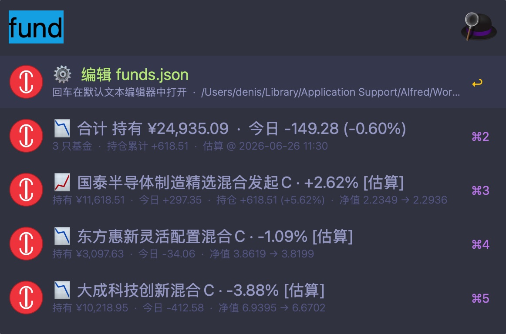

# Funds Alfred

一个 [Alfred 5](https://www.alfredapp.com/) 工作流，用于在 Alfred 中快速查看自选基金的当前情况：**持有额、涨跌幅、估算收益、持仓总收益**。

灵感来源于 Chrome 插件 [`x2rr/funds`](https://github.com/x2rr/funds)（自选基金助手），数据源同样为东方财富（天天基金）公开 API，无需登录。



## 特性

- ✅ 单文件 Python 脚本，**零依赖**（仅用 stdlib），系统 Python 3 即可运行
- ✅ 一次请求获取全部基金数据（东方财富批量接口）
- ✅ **基金分组**：把自选基金拆成多个组（如「核心持仓 / 卫星仓 / 打新仓」），`fund N` 快速切换
- ✅ 列表头部显示**合计**（持有总额、今日估算总收益、总涨跌幅）并标注当前分组名
- ✅ 每只基金显示：涨跌幅、持有额、今日估算收益、持仓总收益（需配置成本价）
- ✅ 红涨绿跌（中国市场习惯，emoji 📈 📉 ➖）
- ✅ 闭市/未估算时优雅降级显示「—」
- ✅ 当日净值已结算时自动用真实净值替换估算值，并标注 ✓
- ✅ **盘中持仓自算估值**：接口不再提供盘中估值后，改由「基金前十大重仓股 + 实时股票行情」加权估算净值（口径 B：按重仓覆盖率缩放到满仓），标注 `[自算]`；详见下文「持仓自算估值」
- ✅ 错误处理：网络失败、JSON 损坏、基金代码不存在等都有友好提示

## 安装

### 方式 1：双击安装

下载 `funds-alfred.alfredworkflow`，双击即可。

### 方式 2：从源码构建

```bash
git clone <this-repo>
cd funds-alfred
./build.sh         # 生成 funds-alfred.alfredworkflow
open funds-alfred.alfredworkflow
```

## 使用

| 关键词 | 行为 |
|---|---|
| `fund` | 查看自选基金列表（默认第 1 个分组） |
| `fund 2` | 切换到第 2 个分组（数字 = 分组序号，从 1 开始） |
| `fund sum` | 跨所有分组合计（仅显示总合计 + 各分组合计，不展示单只基金） |
| `fund config` | 打开配置文件 `funds.json`（默认列表中不会展示编辑入口） |
| `fund refresh` | 清空持仓缓存，下次查询重新拉取重仓股（季报数据，默认缓存 7 天） |

在列表中：
- **回车 ⏎**：在普通基金行上把基金**代码**复制到剪贴板（合计行则复制合计概要；`fund config` 行则直接打开配置文件）
- **⌘C**：复制完整概要（含名称/代码/涨跌幅/收益/持有额）
- **⌘+L**：以 large type 大字号显示当前行

## 分组

把基金按用途/账户/风格分成多组，一组一组地看；切换轻量，零额外网络开销（每次只拉取当前组里的基金）。

### 切换分组

- `fund`：默认显示**第 1 个**分组
- `fund 2`：切到**第 2 个**分组
- `fund N`：切到第 N 个分组（N 从 1 开始计数）
- 越界（如只有 2 组却输入 `fund 9`）会显示提示并回落到第 1 组
- 当前是哪一组，看合计行最前面的 `[分组名]` 即可

合计行示例：

```
📈 [核心持仓] 持有 ¥12,345.67  ·  今日 +56.78 (+0.46%)
📈 招商中证白酒指数(LOF)A · +1.23% [估算]
...
```

### 配置示例

在 `funds.json` 顶层使用 `groups` 数组，每个组有 `name` 与该组的 `funds` 列表：

```json
{
  "groups": [
    {
      "name": "核心持仓",
      "funds": [
        { "code": "161725", "num": 10000, "cost": 0.5162 },
        { "code": "110022", "num": 200,   "cost": 2.50 }
      ]
    },
    {
      "name": "卫星仓",
      "funds": [
        { "code": "001618", "num": 500 }
      ]
    }
  ]
}
```

### 向后兼容

如果你已经在用旧版的「顶层 `funds`」配置（不含 `groups`），无需修改 —— 脚本会自动把它当成一个名为「默认」的分组使用：

```json
{ "funds": [ { "code": "161725", "num": 10000, "cost": 0.5162 } ] }
```

### 边界情况

| 情况 | 行为 |
|---|---|
| `fund N` 序号越界 | 提示「分组序号 N 越界」，回落到第 1 组继续显示 |
| 该组 `funds: []` 为空 | 提示「分组「xxx」尚未配置任何基金」（运行 `fund config` 去补充） |
| 同时存在 `groups` 与 `funds` | 优先使用 `groups`，顶层 `funds` 被忽略 |
| 分组项缺 `name` | 自动命名为「分组 N」 |

### 跨分组合计

`fund sum` 把所有分组的持有/今日收益/持仓总收益**合并求和**，并按组列出每个分组的小计，**不展示单只基金明细**。一次网络请求（跨组同代码自动去重），适合快速看全局：

```
📈 [全部分组] 持有 ¥123,456.78  ·  今日 +678.90 (+0.55%)
📈 [核心持仓] 持有 ¥98,765.43  ·  今日 +543.21 (+0.55%)
📈 [卫星仓]   持有 ¥24,691.35  ·  今日 +135.69 (+0.55%)
➖ [打新仓]   无基金可估算
```

别名：`fund sum` / `fund 汇总` / `fund 总计` / `fund 合计` / `fund all`。

## 配置文件

首次运行 `fund` 会在以下位置生成示例配置：

```
~/Library/Application Support/Alfred/Workflow Data/com.denis.funds-alfred/funds.json
```

新格式（推荐，支持分组）：

```json
{
  "groups": [
    {
      "name": "核心持仓",
      "funds": [
        { "code": "161725", "num": 10000, "cost": 0.5162 },
        { "code": "110022", "num": 200, "cost": 2.50 }
      ]
    },
    {
      "name": "卫星仓",
      "funds": [
        { "code": "001618", "num": 500 }
      ]
    }
  ]
}
```

旧格式（兼容，会被当作单个名为「默认」的分组）：

```json
{
  "funds": [
    { "code": "161725", "num": 10000, "cost": 0.5162 },
    { "code": "001618", "num": 500 },
    { "code": "110022", "num": 200, "cost": 2.50 }
  ]
}
```

字段说明：

| 字段 | 必填 | 说明 |
|---|---|---|
| `groups[*].name` | ✅ | 分组名（显示在合计行最前面的 `[分组名]` 里；缺省则自动命名为「分组 N」） |
| `groups[*].funds` | ✅ | 该分组下的基金列表 |
| `code` | ✅ | 6 位基金代码（字符串；如 `"001618"`，前导零不会丢） |
| `num` | ✅ | 持有份额 |
| `cost` | ❌ | 成本价；填写后才会显示「持仓总收益 / 持仓收益率」 |

## 数据接口

调用天天基金 `FundMNFInfo` 批量接口（与 choose-funds / LiuRabt 扩展同款）：

```
GET https://fundmobapi.eastmoney.com/FundMNewApi/FundMNFInfo
    ?pageIndex=1&pageSize=200&plat=Android&appType=ttjj&product=EFund&Version=1
    &deviceid=<UUID>&Fcodes=<基金代码1>,<基金代码2>,...
```

返回示例（纯 JSON，`Datas` 为数组）：

```json
{"Datas":[
  {"FCODE":"161725","SHORTNAME":"招商中证白酒指数(LOF)A",
   "PDATE":"2026-07-21","NAV":"0.5500","NAVCHGRT":"-1.47",
   "GSZ":null,"GSZZL":null,"GZTIME":null},
  {"FCODE":"000001","SHORTNAME":"华夏成长混合",
   "PDATE":"2026-07-21","NAV":"1.4450","NAVCHGRT":"10.64",
   "GSZ":null,"GSZZL":null,"GZTIME":null}
]}
```

- 无需 Cookie / Token / 鉴权
- 单次请求批量拉取整个分组（`Fcodes` 逗号分隔）
- 字段映射：`FCODE->fundcode`、`SHORTNAME->name`、`NAV->dwjz`、`PDATE->jzrq`、`GSZ->gsz`、`GSZZL->gszzl`、`GZTIME->gztime`、`NAVCHGRT->navchgrt`
- 不存在的基金代码不会出现在 `Datas` 中，脚本识别为「未找到」
- **两套涨跌幅**：盘中估算 `GSZ/GSZZL`（交易时段才有；主动管理型基金可能始终没有）；净值涨跌幅 `NAVCHGRT`（始终有值）。`GSZ` 缺失时用 `NAVCHGRT` 兜底，故结算后或无盘中估值的基金仍能显示当日涨跌幅与收益。

> 历史：2026-07-21 `fundgz.1234567.com.cn` JSONP 端点 301 下线后，曾短暂使用 `FundValuationLast` 接口；但该接口结算后仍返回残留的盘中估算（不准），且对主动管理型基金 `GSZZL` 也为 null 只能显示 `-`。2026-07-22 改用 `FundMNFInfo` + `NAVCHGRT` 兜底，参考 choose-funds 扩展。2026-07-29 起 `FundMNFInfo` 对多数基金也不再返回 `GSZ`（盘中估值彻底无接口来源），新增「持仓自算估值」补齐盘中估算。

## 持仓自算估值

盘中、未结算时，用基金最新季报的**前十大重仓股 + 占净值比**，配合重仓股**实时行情**加权估算净值，替代已下线的接口盘中估值。

**数据源**（均无需鉴权）：

| 用途 | 端点 |
|---|---|
| 基金重仓股 | `https://fundf10.eastmoney.com/FundArchivesDatas.aspx?type=jjcc&code=<code>&topline=10&year=<Y>&month=<M>`（`month` 取季度末月 3/6/9/12；返回 HTML，提取「股票代码 + 占净值比」） |
| 股票实时行情 | `https://push2.eastmoney.com/api/qt/ulist.np/get?fltt=2&secids=<市场.代码,...>&fields=f12,f14,f2,f3`（`f3`=当日涨跌幅%） |

**计算口径**（默认口径 B，可由 `workflow/fund.py` 顶部 `SCALE_TO_FULL` 切换）：

```
覆盖率 cov    = Σ weight_i            (前十大占净值比之和, %)
贡献   contrib = Σ (weight_i × return_i)
口径B  est%   = contrib / cov         (放大到满仓; 适合指数/行业基金)
口径A  est%   = contrib / 100         (其余按0; 保守低估)
估算净值 gsz_est = NAV × (1 + est%/100)
```

- 季报有披露滞后，按当前月份倒推最近 4 个季度，取首个非空者。
- 持仓缓存到 `${alfred_workflow_data}/holdings_cache.json`，有效期 7 天；`fund refresh` 强制清缓存重拉。
- 兜底降级链：持仓自算 → 跟踪指数自算 → 母 ETF 行情推估 → 接口 GSZ（若有）→ 已结算 `NAVCHGRT` → `[无估值]`。
- 前十大覆盖率低于 `MIN_COVERAGE`(默认 20%) 视为不可信，降级。

**跟踪指数回退**（ETF 联接 / 指数基金）：联接基金 95%+ 仓位是 ETF 份额，重仓股覆盖率极低（如 011608 仅 0.3%）。对此类基金，从 `FundMNDetailInformation.INDEXCODE` 取跟踪指数代码，用指数实时涨跌估算（指数含全成份股，比重仓十只更准）。指数代码市场前缀：`399xxx` 深市、`159xxx` 深市 ETF、其余沪市。

**母 ETF 行情推估**（标的为境外指数公司的非交易指数）：部分联接基金跟踪的指数在东方财富行情系统中无代码（如标普系列的 `SPCLLHCP` 标普中国A股大盘红利低波50，push2 查不到）。此时按 `workflow/fund.py` 顶部 `LINKED_ETF_BY_INDEX` 映射表取其母 ETF（如 `008163` → `515450` 南方标普红利低波50ETF）的场内实时涨跌推估联接基金净值（场内价有折溢价，估算够用）。映射表可按需扩充；未收录的字母指数保持 `[无估值]`。

## 计算逻辑

参考 choose-funds / LiuRabt 扩展（同款 `FundMNFInfo` 接口），计算口径：

| 指标 | 公式 |
|---|---|
| 持有额 | 盘中 `gsz × num`（gsz 为持仓自算或接口估算）；已结算 `dwjz × num` |
| 涨跌幅 | 盘中持仓自算 `est%` 或接口 `gszzl`；已结算 `navchgrt`（真实） |
| 今日收益 | 盘中自算 `(gsz_est − dwjz) × num`；已结算 `(dwjz − dwjz/(1+navchgrt/100)) × num` |
| 持仓总收益 | `(base − cost) × num`（仅当 `cost` 存在；base 盘中取 gsz、已结算取 dwjz） |
| 持仓收益率 | `(base − cost) / cost × 100%` |

## 常见问题

**Q: 闭市 / 主动管理型基金会显示 - 吗？**
A: 基本不会。本 workflow 使用 `FundMNFInfo` 接口，除盘中估算（`GSZ`）外还取净值涨跌幅（`NAVCHGRT`，始终有值）。`GSZ` 缺失时（收盘结算后、或主动管理型基金本就无盘中估值）自动用 `NAVCHGRT` 兜底，仍显示当日涨跌幅与收益并标记 `✓`。仅在极少数情况（开盘前凌晨、基金当天暂停估值且净值也未更新）才会显示 `-`。

> 2026-07-21 前使用的 `fundgz.1234567.com.cn` 端点几乎对所有基金都返回估值；切换到 `FundMNFInfo` 后，主动管理型基金在结算后也能借 `NAVCHGRT` 显示当日涨跌幅。

**Q: 基金代码以 0 开头怎么办？**
A: JSON 中**必须用字符串**，例如 `"code": "001618"`，否则 JSON 解析后会变成数字 `1618` 导致请求失败。脚本会自动补零到 6 位，但仍建议你直接写成字符串。

**Q: 盘中持仓自算估值准吗？**
A: 对指数/行业基金较准（持仓稳定、前十集中度高）；对主动管理型只能粗略参考（仅公开前十大重仓股，覆盖可能不足，且季报数据有滞后，期间调仓无法跟踪）。默认按重仓覆盖率缩放到满仓（口径 B）；若发现系统性偏估，可把 `workflow/fund.py` 顶部 `SCALE_TO_FULL` 改 `False` 切口径 A。仅作参考，以结算后真实净值为准。

**Q: 如何卸载？**
A: 在 Alfred Preferences → Workflows 中右键 → Remove。配置文件在 `~/Library/Application Support/Alfred/Workflow Data/com.denis.funds-alfred/` 下，可手动删除。

## 致谢

- 数据源：[东方财富网 / 天天基金](https://fund.eastmoney.com/)
- 灵感来源：[x2rr/funds](https://github.com/x2rr/funds)（GPL-3.0）

## License

MIT
